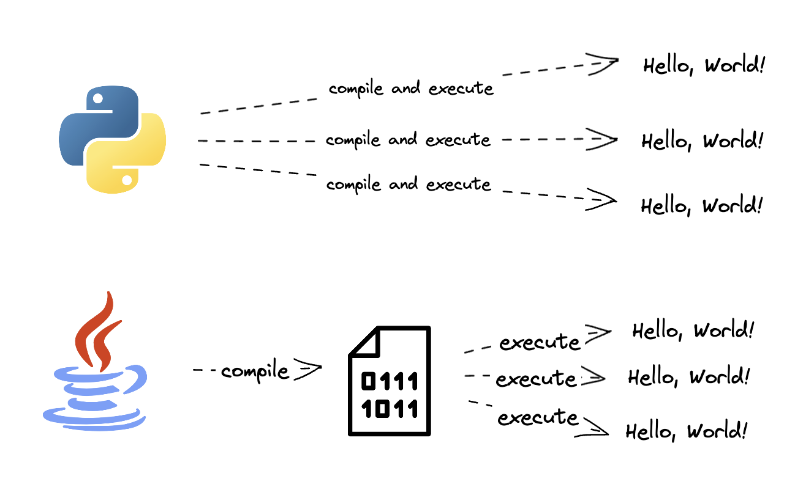

# Running Java

In this bite, you will learn how to run Java code. If you'd prefer to watch a
video version of this, skip down to the [demonstration](#demonstration). (We 
still recommend that you follow along, to ensure that your Java installation is
set up correctly.)

## Introduction

You can run Java code in several ways - let's start with an approach that is 
suitable for when you have a single file.

First, open a terminal and navigate to your `java_fundamentals_with_intellij` 
directory. Then you can run some Java code that we wrote:

```shell
# You should see a "Hello..." message printed to your terminal when you do this
; java ./bites/examples/Message.java
```

Once you start working with more than one file, however, this approach becomes 
a bit cumbersome, as you'd have to list out all of the files that you want to 
execute. So, instead, you'll use some more sophisticated tools, some of which 
are built right into your text editor.

To try running some code in IntelliJ now, open the 
`java_fundamentals_with_intellij` directory in IntelliJ by starting IntelliJ, 
selecting to `open` a project, then selecting the 
`java_fundamentals_with_intellij` directory.


Once you're ready, use the Project pane on the left to find and open the 
`Message.java` file, which is inside `bites/examples`. Then find and click on 
the Run button (with the green 'play' icon).


If everything works, you should see some text printed to IntelliJ's integrated 
terminal.

> From now on, we'll use IntelliJ to run Java, since it's more useful in the 
> long term.

## A Note on Compilation

Java is often described as a compiled language, which means _all the code_ of 
your program is converted (compiled) into a lower-level language (that is 
understood by processors) before anything else happens. After compilation, the 
code can be repeatedly executed without the need for repeated compilation.

This is different to languages like Python, that compile and execute in 
something more like real-time every time you want to run the code.



> The important thing here is that you know Java compilation and execution are 
> two different steps and that your code will be compiled, in its entirety, 
> before being executed. Later on we'll see how things can go wrong at either 
> point.

## Demonstration

[Demonstration Video](https://youtu.be/bv-qSQBUjyI)

[Next Challenge](02_writing_java_bite.md)

<!-- BEGIN GENERATED SECTION DO NOT EDIT -->

---

**How was this resource?**  
[😫](https://airtable.com/shrUJ3t7KLMqVRFKR?prefill_Repository=makersacademy%2Fjava-fundamentals-with-intellij&prefill_File=bites%2F01_running_java_bite.md&prefill_Sentiment=😫) [😕](https://airtable.com/shrUJ3t7KLMqVRFKR?prefill_Repository=makersacademy%2Fjava-fundamentals-with-intellij&prefill_File=bites%2F01_running_java_bite.md&prefill_Sentiment=😕) [😐](https://airtable.com/shrUJ3t7KLMqVRFKR?prefill_Repository=makersacademy%2Fjava-fundamentals-with-intellij&prefill_File=bites%2F01_running_java_bite.md&prefill_Sentiment=😐) [🙂](https://airtable.com/shrUJ3t7KLMqVRFKR?prefill_Repository=makersacademy%2Fjava-fundamentals-with-intellij&prefill_File=bites%2F01_running_java_bite.md&prefill_Sentiment=🙂) [😀](https://airtable.com/shrUJ3t7KLMqVRFKR?prefill_Repository=makersacademy%2Fjava-fundamentals-with-intellij&prefill_File=bites%2F01_running_java_bite.md&prefill_Sentiment=😀)  
Click an emoji to tell us.

<!-- END GENERATED SECTION DO NOT EDIT -->
