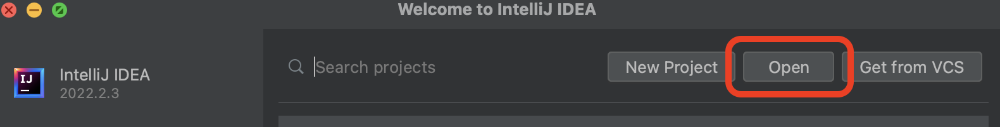
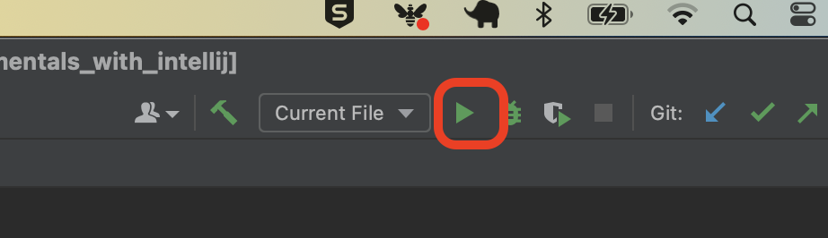
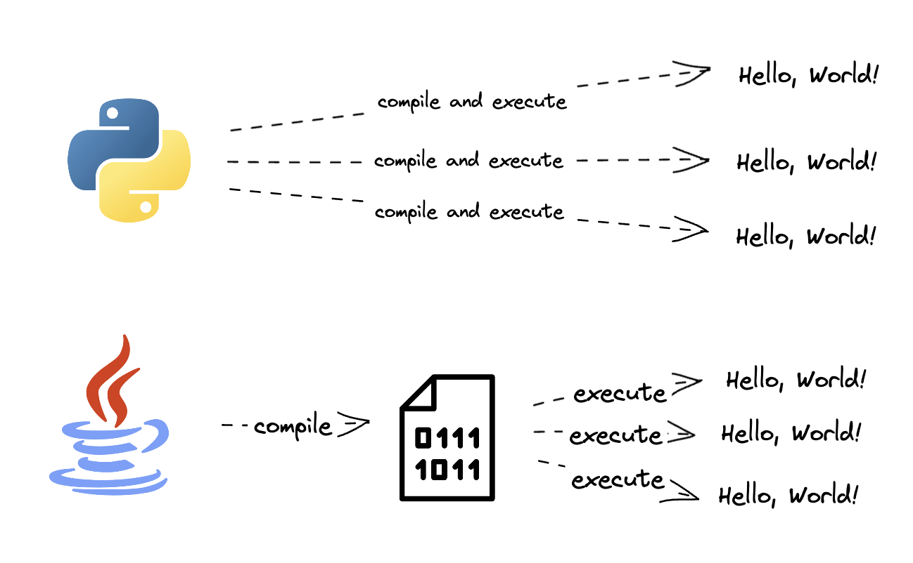

# Running Java

<!-- OMITTED -->

Learn to run Java code - if you prefer to watch a video, skip down to the [demonstration](#demonstration)

## Introduction

You can run Java code in several ways - let's start with an approach that is suitable for when you have a single file.

First, open a terminal and make sure you're in the `java_fundamentals_with_intellij` directory. Then you can run some Java code that we wrote...

```shell
# You should see message printed to your terminal when you do this
; java ./bites/examples/Message.java
```

Once you start working with more than one file, however, this approach becomes a bit cumbersome as you'd have to list out all the files you want to execute. So, instead, you'll use some more sophisticated tools, some of which are built right into your text editor.

To try running some code in IntelliJ now, open the `java_fundamentals_with_intellij` directory in IntelliJ by starting IntelliJ, selecting to `open` a new project then navigating to the `java_fundamentals_with_intellij` directory.



Once you're ready, use the Project pane on the left to find and open the `Message.java` file, which is inside `bites/examples`. Then find and click on the little play button.



If everything works, you should see some text printed to IntelliJ's integrated terminal.

> From now on, we'll use IntelliJ to run Java since it's more useful in the long term.

## A Note on Compilation

Java is often described as a compiled language, which means _all the code_ of your program is converted (compiled) into a lower-level language (that is understood by processors) before anything else happens. After compilation, the code can be repeatedly executed without the need for repeated compilation.

This is different to languages like Python, that compile and execute in something more like real-time every time you want to run the code.



> The important thing here is that you know Java compilation and execution are two different steps and that your code will be compiled, in its entirety, before being executed. Later on we'll see how things can go wrong at either point.

## Demonstration

[Demonstration Video](https://youtu.be/bv-qSQBUjyI)


[Next Challenge](03_writing_java_bite.md)

<!-- BEGIN GENERATED SECTION DO NOT EDIT -->

---

**How was this resource?**  
[😫](https://airtable.com/shrUJ3t7KLMqVRFKR?prefill_Repository=makersacademy%2Fjava-fundamentals-with-intellij&prefill_File=out%2Fproduction%2Fjava_fundamentals_with_intellij%2Fbites%2F02_running_java_bite.md&prefill_Sentiment=😫) [😕](https://airtable.com/shrUJ3t7KLMqVRFKR?prefill_Repository=makersacademy%2Fjava-fundamentals-with-intellij&prefill_File=out%2Fproduction%2Fjava_fundamentals_with_intellij%2Fbites%2F02_running_java_bite.md&prefill_Sentiment=😕) [😐](https://airtable.com/shrUJ3t7KLMqVRFKR?prefill_Repository=makersacademy%2Fjava-fundamentals-with-intellij&prefill_File=out%2Fproduction%2Fjava_fundamentals_with_intellij%2Fbites%2F02_running_java_bite.md&prefill_Sentiment=😐) [🙂](https://airtable.com/shrUJ3t7KLMqVRFKR?prefill_Repository=makersacademy%2Fjava-fundamentals-with-intellij&prefill_File=out%2Fproduction%2Fjava_fundamentals_with_intellij%2Fbites%2F02_running_java_bite.md&prefill_Sentiment=🙂) [😀](https://airtable.com/shrUJ3t7KLMqVRFKR?prefill_Repository=makersacademy%2Fjava-fundamentals-with-intellij&prefill_File=out%2Fproduction%2Fjava_fundamentals_with_intellij%2Fbites%2F02_running_java_bite.md&prefill_Sentiment=😀)  
Click an emoji to tell us.

<!-- END GENERATED SECTION DO NOT EDIT -->
