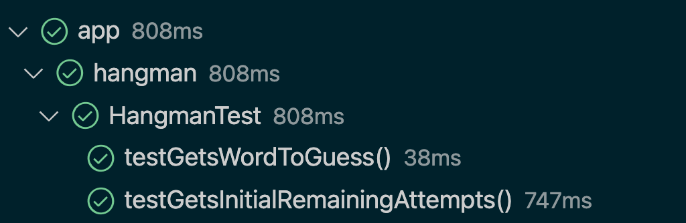

# Building a word-guessing game: Part 1

In this week's pairing challenge, you'll build an old school favourite — a word-guessing game in the terminal! Here's the specification for this game:

 * When the game starts, it will choose a random word from a list of words.
 * The game will then display the word to guess, with only the first letter visible (e.g `H____` for "HOUSE").
 * The player starts a counter of 10 attempts.
 * The player will then be prompted to enter a letter they think might be in the word.
 * If the letter is in the word, the game will display the word to guess, with the new letter visible.
 * If the letter is not in the word, the game will display the same letters as before, and decrease the counter of remaining attempts.
 * If the counter of attempts reaches zero, the player loses.
 * If the player finds all the letters in the word, they win.

## Objectives 

 * Initialising a new project with `gradle`.
 * Writing a test class and tests
 * Writing a class and a method.
 * Define a class constructor.
 * Define class attributes.
 * Using a loop and some of Java's built-in classes, like `StringBuilder`.
 * Running tests.

## Project setup

1. Initialise a new Gradle project called `game`.
2. Run the tests that Gradle generated for us to make sure everything is setup.

## Exercise - a first test

To complete this exercise, you'll need to:
  * write a test class `GameTest`.
  * write a class `Game` and a method.
  * return a value with a given type.

We'll focus first on test-driving the display of the initial word to guess, with only the first letter visible. Let's create a class `GameTest` that will contain tests for the main `Game` class:

```java
package game;

import static org.junit.Assert.assertEquals;

import org.junit.Test;

public class GameTest {
  @Test public void testGetsWordToGuess() {
    Game game = new Game();
    assertEquals(game.getWordToGuess(), "B_____");
  }
}
```

### Questions

1. What is the type of the value on the "right" of the assertion ("B_____")? What then needs to be the type returned by `getWordToGuess()`? 
2. Write the class `Game` with the minimal required code to make this test pass. Don't worry too much about any game logic. For now, your only goal is to make this test pass.

After completing the following, you should be able to make this first test pass. Your class `Game` should be defined with one method `getWordToGuess`.

## Exercise - hiding the word

<!-- OMITTED -->

To complete this exercise, you'll need to:
  * Implement [a constructor](https://www.tutorialspoint.com/java/java_constructors.htm).
  * Use a loop to iterate on each character of a string.
  * Use Java's [`StringBuilder` class](https://www.javatpoint.com/StringBuilder-class).

### Questions

1. Modify the test so the word to guess is given as an argument when creating the `Game` instance. In the following examples, we'll choose to use the word "MAKERS". 
2. Modify the `Game` class so it receives the word to guess as an argument when created (what needs to be the type of this argument?):
```java
Game game = new Game("MAKERS"); // the word is given when creating the instance
```

3. Modify the `getWordToGuess` method so it returns a string which is the word to guess with all letters hidden except the first one. This is likely to require some thought!
4. Have a look at Java's [`StringBuilder` class](https://www.javatpoint.com/StringBuilder-class). Can you use it to build the hidden word?
5. If you've implemented the class correctly, you can update the test in `GameTest`, and it should pass:
```java
@Test public void testGetsWordToGuess() {
    Game game = new Game("MAKERS");
    assertEquals(game.getWordToGuess(), "M_____");
}
```

Attempt the exercise by yourself before watching the following video:
[Example Solution](https://www.youtube.com/watch?v=SLPTupRLh9w)

## Exercise - debugging

<!-- OMITTED -->

Someone from your cohort wrote the code for the method `getWordToGuess`, however their tests do not pass yet.
```java
public String getWordToGuess() {
    StringBuilder builder = new StringBuilder();
    for (int i = 0; i == this.word.length(); i++) {
        Character currentLetter = word.charAt(0);
        if (i == 0) {
            builder.append(currentLetter);
        } else {
            builder.append("_");
        }
    }
}
```

1. Find the issues in the code above. How would you fix it?
2. Once you've found how to fix it, you can compare this code with your own solution. You can also replace your code with the version above, if you'd like!

## Exercise - adding the attempts counter

To complete this exercise, you'll need to:
  * Define [a class attribute](https://www.w3schools.com/java/java_class_attributes.asp) and read its value.
  * Define a new method.
  * Write a new JUnit test.
  * Use `Integer.valueOf()` in your test.

### Questions

1. Modify the `Game` class so it holds the number of remaining attempts for the player. This counter should be initialised at 10.
2. Test-drive a new method `getRemainingAttempts()` to verify the game is created with the correct number of remaining attempts. You should end up with an output similar to this one in your tests explorer (2 tests or more):



## Exercise - a random word

To complete this exercise, you'll need to:
  * Define a [constant ("final") attribute](https://www.javatpoint.com/java-constant).
  * Declare a Java array (of `String`s).
  * Access a random array element.

We're going to change the behaviour of the game so it picks a random word from a list of words.
**Note that we will not follow a TDD approach for the next few changes of this exercise.**

1. Add a constant called `DICTIONARY` to the Game class. This will be an array of a few words: let's have "MAKERS", "CANDIES", "DEVELOPER", "LONDON", for a start.
2. Implement a method `getRandomWordFromDictionary` that picks a random word from this array. What should be the return type of this method?
3. Change the *constructor* of the `Game` class so it doesn't take any argument for the initial word. Instead, it should use the new method `getRandomWordFromDictionary` to assign the word to guess.

Attempt the exercise by yourself before watching the following video:
[Example Solution](https://www.youtube.com/watch?v=4kgxHtR0aMY)

## Exercise - debugging

<!-- OMITTED -->

Someone from your cohort wrote the code for the method `getRandomWordFromDictionary`, using the `Random` utility class to generate random numbers. However, their code does not compile. Can you find why?

```java
public Integer getRandomWordFromDictionary() {
    Random rand = new Random();
    return DICTIONARY[rand.nextInt(DICTIONARY.length)];
}
```


[Next Challenge](02_challenge_word_chooser.md)

<!-- BEGIN GENERATED SECTION DO NOT EDIT -->

---

**How was this resource?**  
[😫](https://airtable.com/shrUJ3t7KLMqVRFKR?prefill_Repository=makersacademy%2Fjava-fundamentals-with-intellij&prefill_File=out%2Fproduction%2Fjava_fundamentals_with_intellij%2Fmain%2F01_challenge_game.md&prefill_Sentiment=😫) [😕](https://airtable.com/shrUJ3t7KLMqVRFKR?prefill_Repository=makersacademy%2Fjava-fundamentals-with-intellij&prefill_File=out%2Fproduction%2Fjava_fundamentals_with_intellij%2Fmain%2F01_challenge_game.md&prefill_Sentiment=😕) [😐](https://airtable.com/shrUJ3t7KLMqVRFKR?prefill_Repository=makersacademy%2Fjava-fundamentals-with-intellij&prefill_File=out%2Fproduction%2Fjava_fundamentals_with_intellij%2Fmain%2F01_challenge_game.md&prefill_Sentiment=😐) [🙂](https://airtable.com/shrUJ3t7KLMqVRFKR?prefill_Repository=makersacademy%2Fjava-fundamentals-with-intellij&prefill_File=out%2Fproduction%2Fjava_fundamentals_with_intellij%2Fmain%2F01_challenge_game.md&prefill_Sentiment=🙂) [😀](https://airtable.com/shrUJ3t7KLMqVRFKR?prefill_Repository=makersacademy%2Fjava-fundamentals-with-intellij&prefill_File=out%2Fproduction%2Fjava_fundamentals_with_intellij%2Fmain%2F01_challenge_game.md&prefill_Sentiment=😀)  
Click an emoji to tell us.

<!-- END GENERATED SECTION DO NOT EDIT -->
