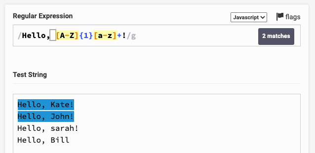

# Regular Expressions

A regular expressions (often shortened to "regex" or "regexp") is a powerful 
tool for matching patterns in text. Regexes are used in many programming 
languages, as a way of reliably identifying text which corresponds to a 
particular pattern, but where the exact text content is not known or 
varies.

## A simple example

Even the most basic regular expressions can still be incredibly helpful. 
Suppose you have a webpage which displays some text "Priority: X" (where X is 
a number from 1 to 5). A regular expression which could match this pattern 
would be:

`/Priority: [1-5]/`

The square brackets (and the dash) indicate that the character inside the
brackets can be any of the characters between the first and last characters
in the brackets. So, for example, the regex above would match "Priority: 1",
"Priority: 2", "Priority: 3", "Priority: 4" and "Priority: 5". It wouldn't 
match "Priority: 6", because 6 is not between 1 and 5.

## A more complex example

Sometimes regular expressions are more complicated, but still understandable 
if you break them down into smaller pieces. Consider a UK National Insurance 
number, which is always in the pattern "AB 12 34 56 C" (or sometimes with an 
extra letter at the end, e.g. "AB 12 34 56 CD"). Here is a regular expression 
which will match that pattern:

`/[A-Z]{2} [0-9]{2} [0-9]{2} [0-9]{2} [A-Z]{1,2}/`

Here, we're using the same square bracket syntax as before, but we're also
using curly brackets to indicate the number of characters that should match
the preceding pattern. So `[A-Z]{2}` means "match two uppercase letters", and
`[0-9]{2}` means "match two digits". The curly brackets can also be used to
indicate a range of numbers, e.g. `[A-Z]{1,2}` means "match one or two
uppercase letters".

## Advanced regular expressions

Regular expressions are undoubtedly powerful, but their ability to match 
dynamic data means that it can be very easy to generate regular expressions 
which are unreadable or difficult to maintain. Imagine, for example, that you 
wanted to create a regular expression to identify an email address on a page. 
Initially, you might think that you just need to match a string in the pattern 
`something@something.com`, but when you begin to consider that email addresses 
might contain many other characters, your regex might become very long and 
complicated: [this is the currently recommended regex for validating 
email addresses](https://emailregex.com/).

It's a very long and complicated regex, and it's not even guaranteed to
match all valid email addresses. It's also very difficult to read and
understand, and it's not clear what each part of the regex is doing.

Often, in such situations, it's better to re-analyse the business problem that 
you're trying to solve, and find another way to solve it. For example, if 
you're using this regular expression within your test automation (in order to 
locate an element), consider whether you can use an alternative locator
pattern, such as locating the element by its ID. 

Or, if you're using the regex 
to validate user input, consider whether you can use a simpler validation
method, such as checking that the email address contains an `@` symbol, which 
may be sufficient if you're going to send the user an invite to confirm their 
sign-up (they won't be able to confirm sign-up unless they entered a valid 
email address). 

## Practicing with regular expressions

[RegEx Pal](https://www.regexpal.com/) is a great tool for practising working 
with regexes. It has a simple-to-use interface which offers several tools to 
assist with creating regular expressions:

* In the Regular Expression box, you can enter a sample regex; you can hover 
over sections of your regex and the interface will remind you what each part
of the regular expression is doing.
* In the Test String box, you can enter multiple lines of text, and the site 
will highlight which strings (or sections of strings) your regular expression 
will match against. This means you can enter both positive and negative test
cases, and see how your regex will behave in different situations.
* On the right-hand side of the website, you can find shortcuts to some 
popular regular expressions, as well as a "cheat sheet" of common regular 
expression elements.

Here's an example, where we've written a regular expression that will search 
for the string "Hello, Name!" and will only match if the name begins with a 
capital letter, and if it ends with an exclamation mark.

## Exercise

If you'd like to practice creating regular expressions, here are some examples 
of patterns that you might like to match. In this particular exercise, try to 
avoid Googling or looking on StackOverflow, because the answers are almost 
certainly there - this is specifically an exercise designed to give you more 
"hands-on" time with regular expressions.

1. Write a regular expression which will match a UK telephone number. You can
assume that the telephone number will always be in the format "01234 567890",
where the first part of the number is between 4 and 5 digits long, and the
second part of the number is between 6 and 7 digits long.
2. Try to improve this regular expression, so that it will also match if there 
isn't a space between the two parts of the number. For example, it should
match "01234567890" as well as "01234 567890".
3. Improve the regular expression again, so that it ensures that the first 
digit of the number is a 0 (it shouldn't match "12345 67890").

<!-- BEGIN GENERATED SECTION DO NOT EDIT -->

---

**How was this resource?**  
[😫](https://airtable.com/shrUJ3t7KLMqVRFKR?prefill_Repository=makersacademy%2Fjava-fundamentals-with-intellij&prefill_File=playwright%2Fpills%2Fregular_expressions.md&prefill_Sentiment=😫) [😕](https://airtable.com/shrUJ3t7KLMqVRFKR?prefill_Repository=makersacademy%2Fjava-fundamentals-with-intellij&prefill_File=playwright%2Fpills%2Fregular_expressions.md&prefill_Sentiment=😕) [😐](https://airtable.com/shrUJ3t7KLMqVRFKR?prefill_Repository=makersacademy%2Fjava-fundamentals-with-intellij&prefill_File=playwright%2Fpills%2Fregular_expressions.md&prefill_Sentiment=😐) [🙂](https://airtable.com/shrUJ3t7KLMqVRFKR?prefill_Repository=makersacademy%2Fjava-fundamentals-with-intellij&prefill_File=playwright%2Fpills%2Fregular_expressions.md&prefill_Sentiment=🙂) [😀](https://airtable.com/shrUJ3t7KLMqVRFKR?prefill_Repository=makersacademy%2Fjava-fundamentals-with-intellij&prefill_File=playwright%2Fpills%2Fregular_expressions.md&prefill_Sentiment=😀)  
Click an emoji to tell us.

<!-- END GENERATED SECTION DO NOT EDIT -->
